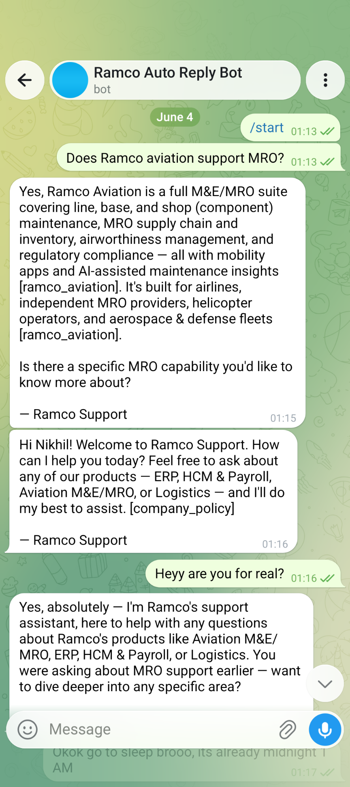
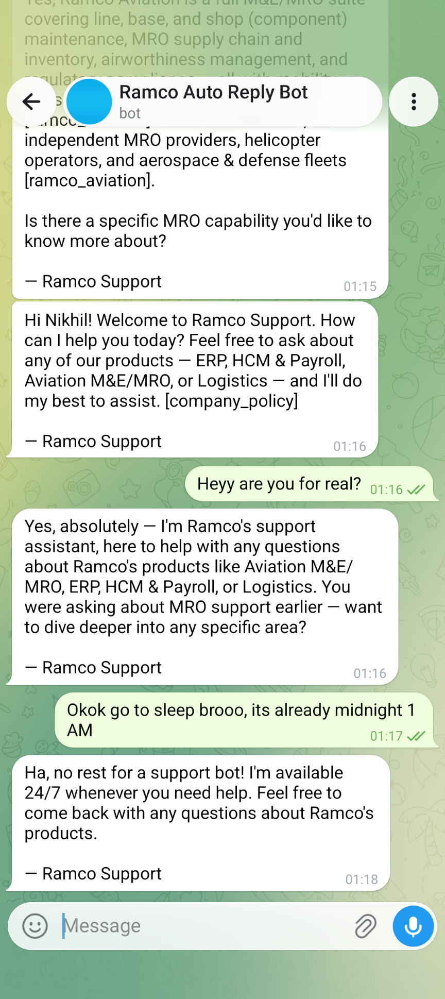
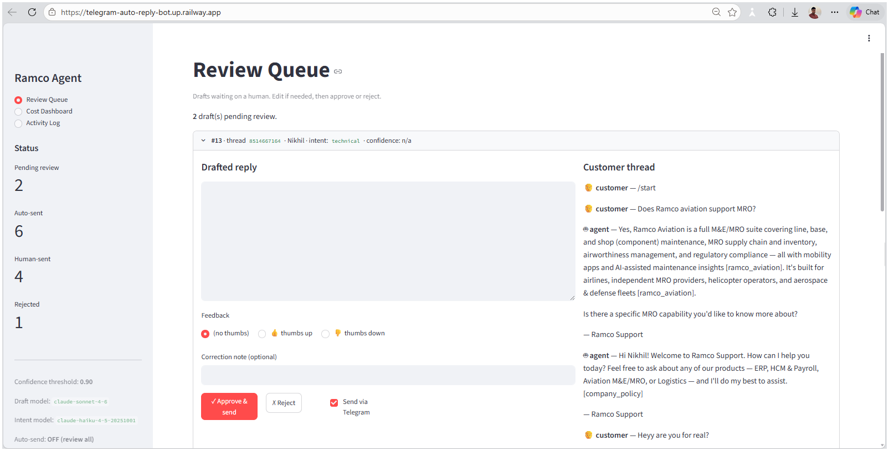
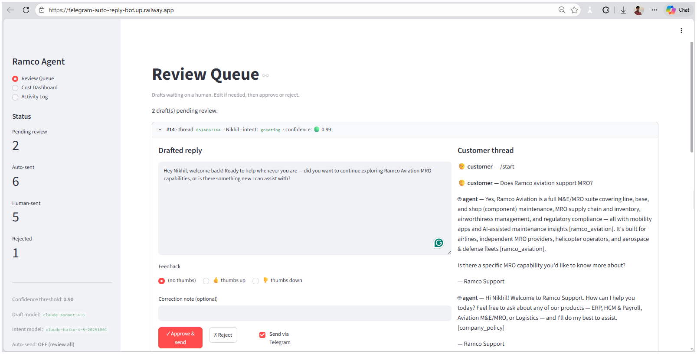
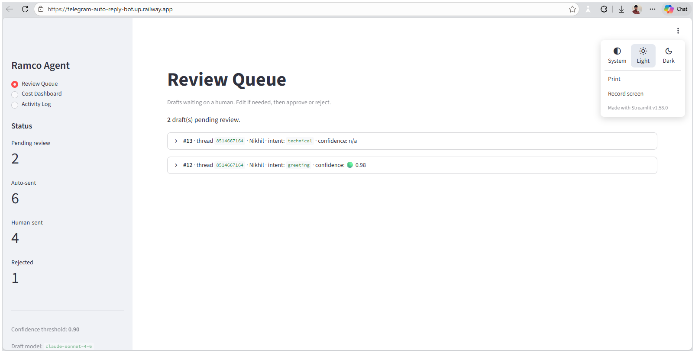

# Telegram Auto-Reply Bot — Ramco Products

A confidence-gated LLM support agent that answers questions about Ramco's Enterprise Software on Telegram. Incoming messages are classified by intent, answered from a curated knowledge base using Claude, scored by a small Neural Network, and either auto-sent (high confidence) or queued for human review (low confidence).

**Live bot:** `@ramco_assist_bot`  
**Review dashboard:** https://telegram-auto-reply-bot.up.railway.app/  
**Deployed on:** Railway (poller + dashboard + Postgres)

---

## Architecture

```
Telegram message (getUpdates long-poll)
    │
    ▼
Intent Router — claude-haiku-4-5  (cheap; greeting/off-topic answered inline)
    │  pricing · refund · technical · other
    ▼
Context Builder
  • LLM Wiki  (5 Ramco product pages + company policy)
  • Current chat history
  • Past-conversation summary
  • Feedback log (approved Q→A pairs)
    │
    ▼
Drafter — claude-sonnet-4-6  (anti-hallucination prompt; cites sources; logs cost)
    │
    ▼
Confidence Net — sklearn MLP (32→16)  →  score 0–1
    │  ≥ 0.90 & AUTO_SEND_ENABLED          < 0.90 (or AUTO_SEND off)
    ▼                                       ▼
auto-send to Telegram              human-review dashboard → approve/edit → send
    └────────────────► feedback log → labels for next MLP retrain
```

The Telegram connector (`tg/`) is the only platform-specific module — the rest of the pipeline is platform-agnostic.

---

## Key Features:                                 

- **Zero pricing hallucinations** — pricing is recorded as "not published publicly" in the wiki, so the correct deflection IS the grounded answer
- **Cheap router / quality drafter split** — Haiku for intent (~$0.0006/reply), Sonnet for drafting (~$0.0093/reply), MLP for confidence scoring (free)
- **Cold-start MLP** — 47 synthetic labeled Ramco Q→A examples seed the confidence model before any real traffic
- **Human-in-the-loop by default** — `AUTO_SEND_ENABLED=false` routes everything to the review queue during cold-start and demos
- **Per-call cost logging** — every LLM call logs model, tokens, and cost_usd to Postgres; surfaced in the dashboard
- **Railway multi-service deploy** — one Docker image, three roles dispatched via `SERVICE_ROLE` env var

---

## Project Structure:                                

```
tg/                   Telegram Bot API connector (raw httpx, named tg/ not telegram/)
agent/                Intent router, context builder, LLM drafter, pipeline, poller
confidence/           MLP features, training, prediction, artifact (pickle-safe)
dashboard/            Streamlit human-review queue
server/               Minimal FastAPI landing + health endpoint (web role)
wiki/                 LLM wiki builder + Ramco product Markdown pages
db/                   SQLite/Postgres schema + connection
prompts/              System prompts for intent router and drafter
scripts/              seed_history, smoke_pipeline, evaluate, make_report_docx
data/                 ramco_products.json, eval_results.json, tg_offset.json
config.py             Pydantic Settings (all config from env vars)
Dockerfile            Single image for all three Railway roles
entrypoint.sh         Dispatches poller | dashboard | web based on SERVICE_ROLE
railway.toml          Railway build/deploy config
```

---

## Quickstart (local)                           

```bash                        
# 1. Clone and create venv
git clone https://github.com/mrxjha/Telegram-Auto-Reply-Bot.git
cd Telegram-Auto-Reply-Bot
python -m venv .venv
.venv\Scripts\activate        # Windows
# source .venv/bin/activate   # Linux/Mac

# 2. Install dependencies
pip install -r requirements.txt

# 3. Create .env
cp .env.example .env
# Edit .env — set ANTHROPIC_API_KEY and TELEGRAM_BOT_TOKEN

# 4. Build wiki + seed data + train confidence model
python -m wiki.builder
python -m scripts.seed_history
python -m confidence.train

# 5. Verify pipeline (no Telegram needed)
python -m scripts.smoke_pipeline "Does Ramco ERP have a REST API?"

# 6. Run dashboard
streamlit run dashboard/app.py

# 7. Run poller (requires Telegram reachability — blocked on Ramco corporate network)
python -m agent.poller
```

---

## Environment Variables:                               

| Variable | Default | Description |                             
|---|---|---|
| `ANTHROPIC_API_KEY` | — | Required. Anthropic API key |            
| `TELEGRAM_BOT_TOKEN` | — | Required. Token from @BotFather |
| `AUTO_SEND_ENABLED` | `false` | Set `true` to enable auto-send path |
| `CONFIDENCE_THRESHOLD` | `0.90` | MLP score cutoff for auto-send |
| `INTENT_MODEL` | `claude-haiku-4-5-20251001` | Cheap model for intent routing |
| `DRAFT_MODEL` | `claude-sonnet-4-6` | Quality model for drafting |
| `DATABASE_URL` | `sqlite:///data/agent.db` | SQLite (dev) or Postgres URL (Railway) |
| `SERVICE_ROLE` | — | `poller` / `dashboard` / `web` (Railway multi-service) |
| `POLL_INTERVAL_SEC` | `30` | Telegram getUpdates long-poll timeout |
| `LOG_LEVEL` | `INFO` | Logging level |

---

## Railway Deployment:

Three services share one Docker image, distinguished by `SERVICE_ROLE`:

| Service | Role | Public | Purpose |
|---|---|---|---|
| poller | `poller` | No | Telegram getUpdates loop → pipeline → route |
| dashboard | `dashboard` | Yes | Human review queue + cost dashboard |
| Postgres | — | No | Shared state: threads, drafts, feedback, token usage |

Set `healthcheckPath=/_stcore/health` and `healthcheckTimeout=120` **per-service in the Railway UI** for the dashboard service (not in `railway.toml` — the poller has no HTTP server).

---

## Performance (measured on 10-query balanced eval set):

| Metric | Result |
|---|---|
| Intent accuracy | 100% (10/10) |
| Avg reply latency | 4.30 s |
| Cost per reply | ~$0.0099 |
| True hallucination rate | 0% |

Run `python -m scripts.evaluate` to reproduce.


---


## Screenshots:

### Telegram Bot in Action:

The bot answers a Ramco Aviation MRO question with a grounded, cited reply, handles a casual follow-up, and stays in character as a 24/7 support assistant.





### Human-Review Dashboard:                                     

The Streamlit review queue shows each drafted reply with its intent, confidence score, and the full customer thread — one click to approve/edit and send via Telegram.







---

## Notes

- The Ramco corporate network blocks `api.telegram.org` — the live bot runs on Railway (outside the firewall); the build/test loop uses `scripts/smoke_pipeline` which only calls the Anthropic API (reachable locally)
- Package named `tg/` not `telegram/` to avoid shadowing the `python-telegram-bot` library's top-level package
- `confidence/artifact.py` holds `TrainArtifact` in its own module so the pickle path is always `confidence.artifact.TrainArtifact` (not `__main__.*` which breaks loading in other processes)
